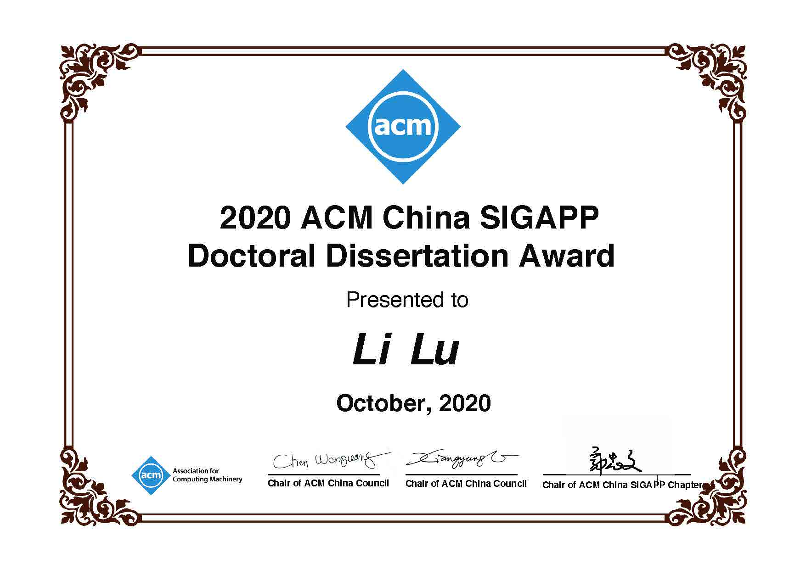
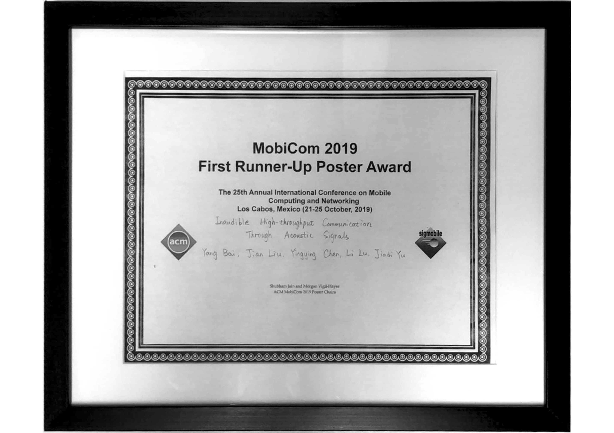

* Dec. 2020 Shanghai Computer Society Doctoral Dissertaion Award Nominations (上海市计算机学会优秀博士学位论文提名奖)

{:height="40%" width="40%" align="center"}
* Oct. 2020 ACM China SIGAPP Doctoral Dissertation Award

{:height="40%" width="40%" align="center"}
* Jun. 2020 Outstanding Graduate of Shanghai (上海市优秀毕业生)

{:height="25%" width="25%"}
* Dec. 2019 National Scholarship for Doctoral Students (博士研究生国家奖学金)
* Nov. 2019 Travel Grant of Global Young Scientists Summit (GYSS) Singapore 2020

{:height="25%" width="25%" align="center"}
* Oct. 2019 First Runner-up Poster Award of ACM MobiCom 2019

{:height="40%" width="40%" align="center"}
* Nov. 2018 National Scholarship for Doctoral Students (博士研究生国家奖学金)
* Jun. 2018 Joint Ph.D. Training Grant of China Scholarship Council (国家留学基金委联合博士培养资助)

{:height="25%" width="25%" align="center"}
* Apr. 2015 Outstanding Graduate (优秀毕业生)
* Nov. 2014 National Encouragement Scholarship (国家励志奖学金)
* Nov. 2013 Lu Shidi 2nd Scholarship (陆诗娣二等奖学金)
* Nov. 2012 National Encouragement Scholarship (国家励志奖学金)

  
